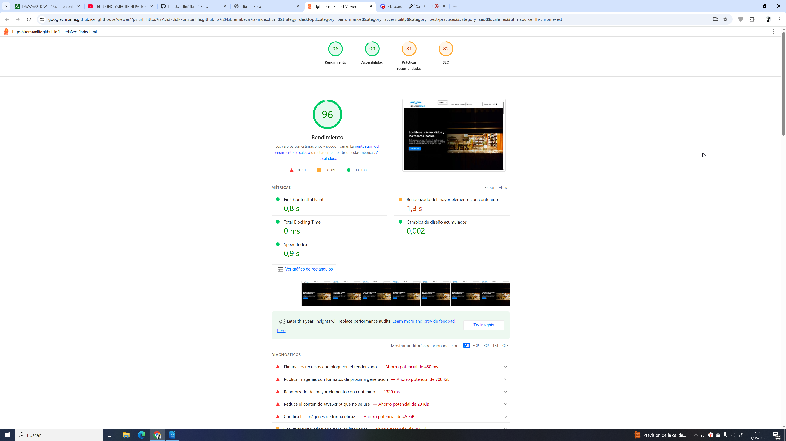
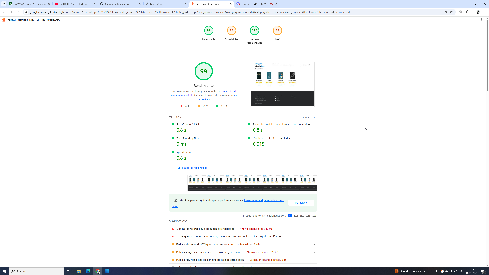
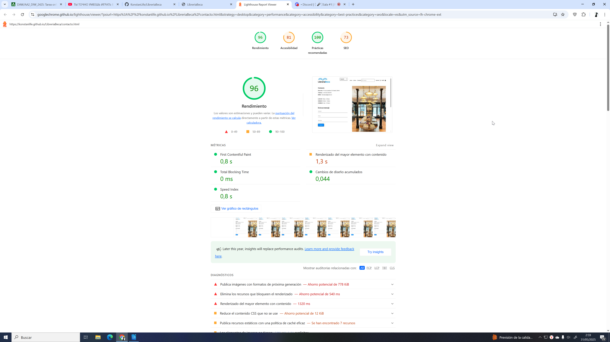
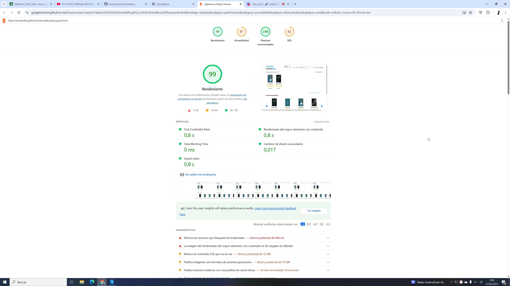
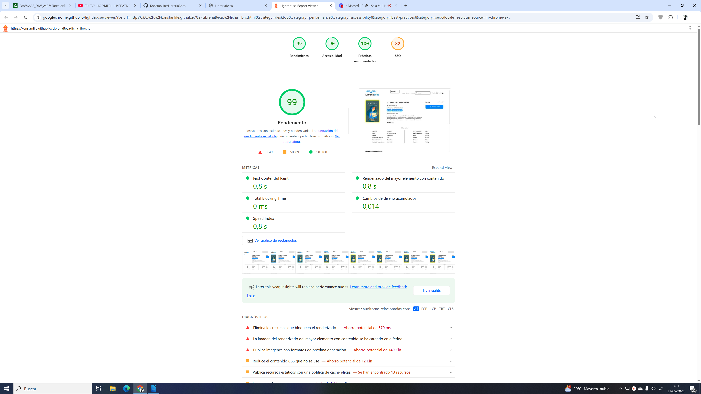
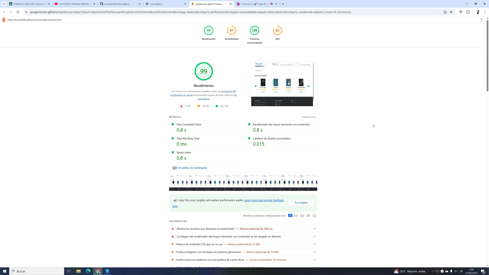

# Proyecto DIW - Diseño de Interfaces Web

**LibreriaBeca**

Este proyecto es la tarea del Módulo Diseño Interfaces Web (DIW). En esta tarea se trabajaron los siguientes aspectos:

- Diseño de página web
- Creación de maqueta con HTML y CSS
- Creación de contenido multimedia
- Animaciones web
- Funciones interactivas con uso de JavaScript

**Nivel de Accesibilidad**

---
**Autor:** Konstantin Krishtapov
